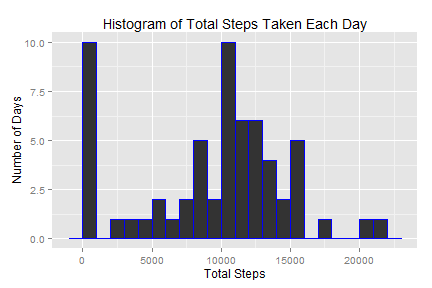
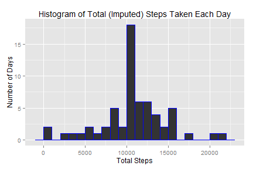
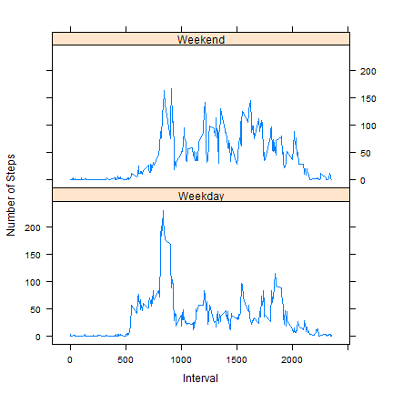

## Assessing Activity (Steps) at Different Intervals Throughtout the Day
### Author: Ganesh Krishnamurthy. Submitted on: October 17, 2015

Initializing the environment and loading libraries:

```r
library(dplyr);
library(ggplot2);
library(data.table);
library(lattice);
setwd("C:/Training/R_Programming/Reproducible_Research/Project_1");
```


### Section 1: Data loading and pre-processing of the activity.csv file

```r
## 1.A: Read in the .csv file containing steps, date and the interval_ID
steps_raw_DF<-read.csv(file="repdata_data_activity/activity.csv", header=TRUE,
                       na.strings="", stringsAsFactors = FALSE, colClasses = c("numeric","character","character"));

## 1.B: Transform/pre-process before analysis: The date field was read in a character. 
## Converting it to a "Date" type. Also, renaming columns for safer analysis - doing
## away with "system" names like 'date', 'interval'. Rename to m_date and interval_ID
steps_raw_DF$date<-as.Date(steps_raw_DF$date, format="%Y-%m-%d");
steps_raw_DF<-rename(steps_raw_DF, m_date=date, interval_ID=interval);
```


### Section 2: Calculating total number of steps taken each day, creating histogram and reporting on mean and median total number of steps

```r
## 2.A: Calculate total steps taken each day
steps_day_grp<-group_by(steps_raw_DF, m_date);
## Ignoring/discarding missing values
steps_day_summary<-summarize(steps_day_grp, total_steps = sum(steps, na.rm=TRUE));
```

Drawing a histogram of steps taken each day

```r
## 2.B: Histogram of total number of steps each day
g<-ggplot(data=steps_day_summary, aes(x=total_steps)) + geom_histogram(col="blue", binwidth=1000) + 
  xlab("Total Steps") + ylab("Number of Days") + ggtitle("Histogram of Total Steps Taken Each Day");
print(g);
```

 

Calculating the mean and median total number of steps (ignoring missing values) taken each day:

```r
## 2.C: Calculate and report the mean and median of the total number of steps taken per day
steps_mean<-mean(steps_day_summary$total_steps, na.rm=TRUE);
steps_mean<-format(steps_mean, nsmall=2);

steps_median<-median(steps_day_summary$total_steps, na.rm=TRUE);
steps_median<-format(steps_median, nsmall=2);
```
**The MEAN total number of steps taken each days is 9354.23.**
**The MEDIAN total number of steps taken each days is 10395.00.**


### Section 3: Calculating average daily activity pattern

```r
## 3.A: Calculate average number of steps taken in each 5 minute interval across all days
steps_interval_grp<-group_by(steps_raw_DF, interval_ID);
steps_interval_summary<-summarize(steps_interval_grp, mean_steps=mean(steps, na.rm=TRUE));
```

Plot time series of average number of steps taken across each 5 minute interval

```r
## Plot in a time series plot. First, re-order the dataset in ascending order of interval_ID
steps_interval_summary<-arrange(steps_interval_summary, as.numeric(interval_ID));
plot(x=as.numeric(steps_interval_summary$interval_ID), y=steps_interval_summary$mean_steps, type="l", 
     xlab="Interval", ylab="Mean number of steps", 
     main="Time Series Plot: Average Steps Taken in Each Interval");
```

 

Identifying 5-minute interval that on average acrosss all days had the maximum number of steps

```r
## 3.B: Identify which interval (average across days) has max steps
max_interval<-steps_interval_summary[which.max(steps_interval_summary$mean_steps),"interval_ID"]
max_interval<-format(max_interval, digit=4);
```
**The 5-minute interval that (on average across all days) contains the maximum number of steps is interval # 835.**


### Section 4: Imputing missing values

Calculating the number of rows with missing values

```r
## 4.A: Report on the number of rows with missing values in them
num_miss_vec<-complete.cases(steps_raw_DF);
num_miss<-sum(!num_miss_vec);
```
**The numbers of rows with missing values is 2304.**

Devising a strategy for imputing/filling-in the missing values. A mean-imputation method was used. Missing values for an interval were replaced by the MEAN number of steps for that interval

```r
## 4.B: All missing values happened in the "steps" column only. Method used: Mean for that specific 5 minute interval, the value for which has already been calculated above (step 3.A/steps_interval_summary)
steps_mergedWith_mean_DF<-merge(steps_raw_DF, steps_interval_summary, by.x="interval_ID", by.y="interval_ID");
```
Impute and create a new dataset equal to the original dataset with missing data filled in

```r
## 4.C: Do the impute and create an equivalent dataset with no missing values
## In the merged data frame, for cases where steps is NA, set the value as mean_steps
## Note: Using Data TABLE for row wise manipulation
DT_mergedSteps<-as.data.table(steps_mergedWith_mean_DF)
DT_mergedSteps[is.na(steps), steps:=mean_steps]
DT_mergedSteps<-DT_mergedSteps[, c("steps", "m_date", "interval_ID"), with=FALSE];
```

Prove that the dataset has the same structure as the original dataset

```r
sapply(DT_mergedSteps, class);
```

```
##       steps      m_date interval_ID 
##   "numeric"      "Date" "character"
```

Creating a histogram of total number of steps taken per day using the imputed steps

```r
## 4.D: Create a histogram of total steps taken each day
## Summarize total steps taken each day using the new imputed dataset
steps_day_imp_grp<-group_by(DT_mergedSteps, m_date);
steps_day_imp_summary<-summarize(steps_day_imp_grp, total_steps=sum(steps));

g<-ggplot(data=steps_day_imp_summary, aes(x=total_steps)) + geom_histogram(col="blue", binwidth=1000) + 
  xlab("Total Steps") + ylab("Number of Days") + ggtitle("Histogram of Total (Imputed) Steps Taken Each Day");
print(g);
```

 

Calculating the mean and median number of steps per day using the imputed steps and comparing against the original (non imputed) mean and median.

```r
## Calculate the mean and median steps per day on this imputed dataset 
steps_imp_mean<-mean(steps_day_imp_summary$total_steps);
steps_imp_mean<-format(steps_imp_mean, nsmall=2);

steps_imp_median<-median(steps_day_imp_summary$total_steps);
steps_imp_median<-format(steps_imp_median, nsmall=2);

## Calculate difference between raw and imputed metrics
mean_diff<-as.numeric(steps_imp_mean) - as.numeric(steps_mean);
median_diff<-as.numeric(steps_imp_median) - as.numeric(steps_median);
```
**The MEAN total steps per day using imputed data is 10766.19.**
**The MEDIAN total steps per day using imputed data is 10766.19.**

**The difference between imputed mean and raw mean total steps per day is 1411.96.**

**The difference between imputed median and raw median total number of steps per day is 371.19.**


### Section 5: Differences in activity patterns between weekdays and weekends

Creating a factor variable to indicate if an activity record is for a weekend or a weekday.

```r
## 5.A: Create a factor variable to indicate whether a day is a weekday or a weekend
## Tip: Use the DT_mergedSteps dataframe(data-table) as it has missing values imputed for "steps"

## Add a column indicating "day" each record
DT_mergedSteps$day_name<-weekdays(DT_mergedSteps$m_date);

## Create a weekend/weekday factor variable
DT_mergedSteps$wkday_fac<-"Weekday"; ## default value which will be over-ridden for condition below
DT_mergedSteps[day_name %in% c("Saturday", "Sunday"), wkday_fac:="Weekend"];
DT_mergedSteps$wkday_fac<-factor(DT_mergedSteps$wkday_fac, levels=unique(DT_mergedSteps$wkday_fac))
```
Showing a panel time series plot of average numbers of steps in each interval shown separately for weekends and weekdays

```r
## Calculate average number of steps for each interval within weekdays and weekends
steps_interval_dayType_grp<-group_by(DT_mergedSteps, wkday_fac, interval_ID);
steps_interval_dayType_summary<-summarize(steps_interval_dayType_grp, mean_steps = mean(steps));

## 5.B: Making a panel plot of weekdays vs weekend for average steps in each interval
## For a clean time series plot, sort the dataframe by interval_ID
steps_interval_dayType_summary<-arrange(steps_interval_dayType_summary, as.numeric(interval_ID));
xyplot(mean_steps ~ as.numeric(interval_ID) | wkday_fac, data=steps_interval_dayType_summary, 
       layout=c(1,2), type=c("l"),
       xlab="Interval", ylab="Number of Steps");
```

 
